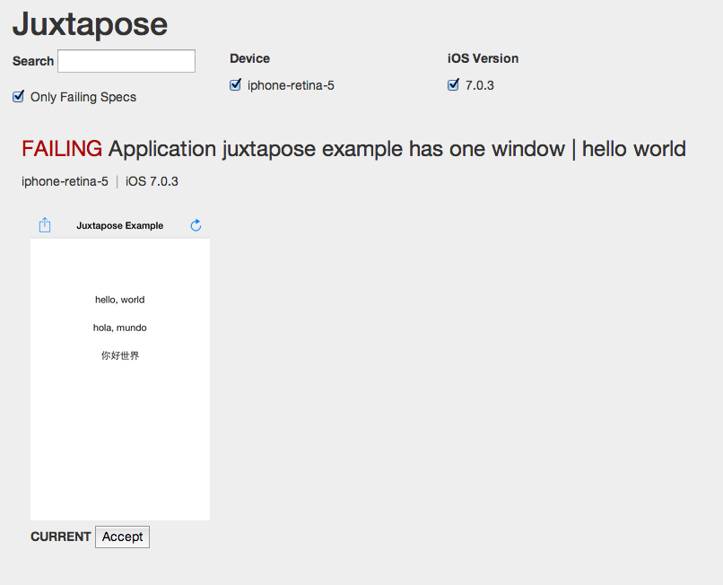
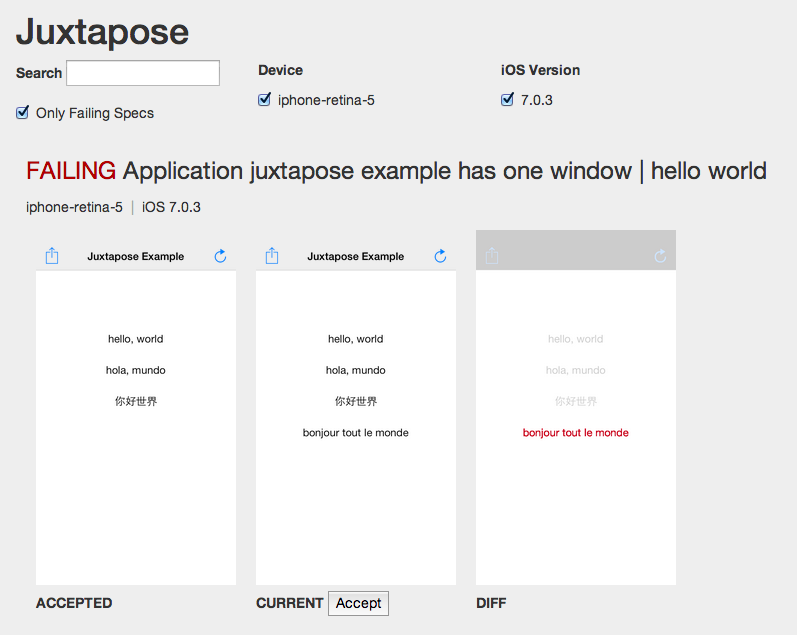

# Juxtapose

Screenshot-driven assertions for testing Rails and RubyMotion applications.

## Installation

Motion-juxtapose uses [ImageMagick](http://www.imagemagick.org/) under the hood for image comparison. If you're using [Homebrew](http://brew.sh/), you can install it with:

    brew install imagemagick

Add this line to your application's Gemfile:

    gem 'motion-juxtapose'

And then execute:

    $ bundle

Or install it yourself as:

    $ gem install motion-juxtapose

## Usage

Juxtapose's workflow generally goes:

1. Write a test that puts your app in the state you want to capture and take a screenshot (see below for how to do this in Bacon and Frank).
2. The first time this screenshot is captured, your test will fail with the error "No accepted screen shot".
3. You must provide Juxtapose an accepted screenshot to match against in future test runs. Run the juxtapose server with `bundle exec juxtapose` and browse to http://localhost:4567 — you should see the just-captured screenshot, like below.
4. If the screenshot looks like what you expect, click Accept to save the image. Future runs of this test will be compared against the accepted one. 
5. Run the tests again, and they should be green.
6. Later, when you introduce a change (intentionally or not), the tests will fail with the message "Screenshot did not match". Open up the juxtapose server again, and you'll see a comparison of your accepted screenshot with what the test captured. 
7. If the change was intentional, you can accept the new screenshot - otherwise, you've got some fixin' to do!


## Testing RubyMotion Apps

### MacBacon

Juxtapose provides a single new matcher: `it_should_look_like` takes a single argument, a descriptive string predicate of what the screen should look like.

Example:

```ruby
describe "home controller" do
  extend Juxtapose

  describe "home controller" do
    tests HomeViewController

    it "has a button that moves when tapped" do
      tap "Goodbye, world!"
      it_should_look_like "when_tapped"
    end
  end
end
```

### Frank

Add the following config to your features/support/env.rb:

```ruby
require 'motion-juxtapose'
Juxtapose::FrankStrategy.setup
```

This lets you write a screenshot matcher along the lines of:

```ruby
Then /^the screen should match "([^\"]*)"$/ do |template|
  wait_for_nothing_to_be_animating
  screenshotter = Juxtapose::Screenshotter.new(self, template)
  max_attempts = 20
  expect(screenshotter.attempt_verify(max_attempts)).to eq(true)
end
```

## Testing Rails Apps

### Capybara

Any Capybara driver that supports screenshot capture should work, but I've only tested this with [Poltergeist](https://github.com/teampoltergeist/poltergeist) so far.

In your `spec_helper.rb`, add:

```ruby
require 'juxtapose/capybara'

# if you're using Rspec, you can get the `look_like?` custom matcher with:
require 'juxtapose/rspec'
```

Now the Capybara page object will have a `looks_like?(predicate)` method that can call to make screenshot assertions:

```ruby
feature "viewing locations", js: true do
  scenario "should only show books at first location" do
    visit location_path Location.find_by_name("Cambridge")
    expect(page).to look_like("books at Cambridge")
  end
end
```

### Fuzzy matching

Sometimes screenshots will differ slightly due to things like animation timing. Juxtapose will try to match an existing screenshot multiple times to help counteract this, but it can still be useful to be able to match screenshots using a percent similarity threshold. 

In bacon specs, you can pass a fuzz factor from 0 to 100 to `it_should_look_like`, 0 meaning an exact match and 100 matching anything of the same size. The default is 0.

```ruby
# matches images that are 15% similar
it_should_look_like 'a fancy animation', 15
```

In Frank, pass the fuzz factor in as the third argument to the Screenshotter constructor. A more exacting Frank step could be written as:

```ruby
Then /^the screen should match "([^\"]*)" within (\d+)% in (\d+) attempts$/ do |template, fuzz_factor, max_attempts|
  wait_for_nothing_to_be_animating
  screenshotter = Juxtapose::Screenshotter.new(self, template, fuzz_factor)
  expect(screenshotter.attempt_verify(max_attempts)).to eq(true)
end
```

### Juxtapose Server

Juxtapose comes with a small webapp that you can use to view your screenshot specs, see diffs between accepted and failing specs and accept any changed images that are expected changes.

To start it, run `bundle exec juxtapose` in the root of your project and browse to localhost:4567.

## Release Notes

#### v.0.2.0
* Rails/rspec support
* Fixes to work under newest version of ImageMagick

#### v.0.1.1

* Raise error if screenshot sizes don't match ([@mdenomy](http://github.com/mdenomy))
* Bug fix: Differentiate image status by filename, not full path. Fixes #8.

#### v.0.1.0

* Initial release.

## Contributors

* [Joe Lind](http://github.com/joelind)
* [Thomas Mayfield](http://github.com/thegreatape )
* [Jeffrey Chupp](http://github.com/semanticart)
* [Michael Denomy](http://github.com/mdenomy)


## Contributing

1. Fork it
2. Create your feature branch (`git checkout -b my-new-feature`)
3. Commit your changes (`git commit -am 'Add some feature'`)
4. Push to the branch (`git push origin my-new-feature`)
5. Create new Pull Request
